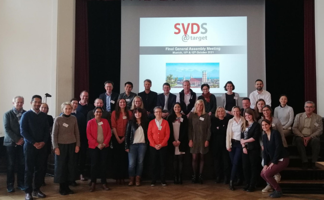

## Investigate-SVDs

Investigate-SVDs aimed to assess the feasibility of acquiring multiple advanced vascular imaging metrics in a multisite study recruiting participants with small vessel disease (SVD) at three sites, the University of Edinburgh, Ludwig-Maximilian University and the University of Maastricht. 

In addition to a detailed structural imaging protocol, we acquired measures of how well the blood vessels open in response to demand (cerebrovascular reactivity), how smooth the in- and out-flowing blood and cerebrospinal fluid were (pulsatility) and how leaky the blood-brain barrier was. As the first study to assess these three vascular dysfunction in the same visit we were also able to assess how different vascular dysfunctions inter-relate.

Finally, Investigate-SVDs established the analysis methods used for Treat-SVDs (described below).

## Treat-SVDs

Treat-SVDs is a clinical trial which aims to assess which of three blood pressure medications show the largest improvement in cerebrovascular reactivity. Participants were recruited across 5 sites (Ludwig-Maximilian University, Universities of Oxford, Edinburgh, Maastricht and University Medical Centre Utrecht).

Treat-SVDs is one of the first trials to use cerebrovascular reactivity as the primary end-point for the trial. 

## Zoom-SVDs

Zoom-SVDs recruited participants with sporadic and genetic small vessel disease, as well as age-matched controls to undergo high-field 7 T MRI scans. These more powerful scanners allow acquisition of images which are higher resolution than would be possible with the scanners which are used clinically or for most research studies. Scanning was performed at the University Medical Centre Utrecht with patients with sporadic SVD recruited locally while CADASIL patients were recruited from Munich.

